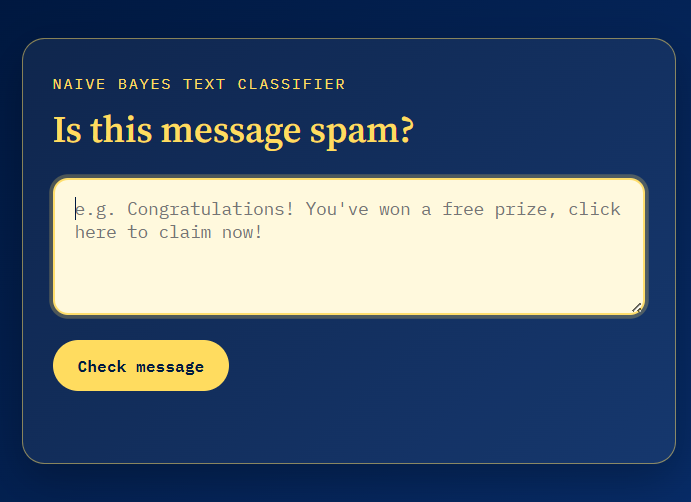

# SMS Spam Detector

A machine learning web app that classifies a text message as **spam** or **ham** (not spam) and shows how confident the model is. The model is trained in Python with scikit-learn and served through a Flask web app.

I built this to learn the full machine learning workflow: preparing text data, training and honestly evaluating a model, and then serving it so someone can actually use it.

## How It Works

1. **Training (`train_model.py`)**: loads the SMS Spam Collection dataset, splits it into training and test sets, converts the text to numbers with TF-IDF, trains a Multinomial Naive Bayes classifier, evaluates it, and saves the model.
2. **Serving (`app.py`)**: a Flask app loads the saved model once at startup. When you submit a message, the API returns the prediction and the probability that it is spam.

## Results

Evaluated on a held-out test set (20% of the data, 1,115 messages) that the model never saw during training:

| Metric | Score |
|---|---|
| Accuracy | 97.8% |
| Precision (spam) | 100% |
| Recall (spam) | 83.9% |

Confusion matrix (test set):

|  | Predicted ham | Predicted spam |
|---|---|---|
| **Actual ham** | 966 | 0 |
| **Actual spam** | 24 | 125 |

**What this means:** no legitimate message was wrongly flagged as spam, but the model missed 24 of the 149 spam messages. The model is cautious, so it rarely blocks a real message, at the cost of letting some spam through.

## Dataset

[SMS Spam Collection](https://archive.ics.uci.edu/dataset/228/sms+spam+collection) from the UCI Machine Learning Repository: 5,572 labelled messages (747 spam, 4,825 ham). The classes are imbalanced, which is why precision and recall are reported alongside accuracy.

## Tech Stack

- **ML:** Python, scikit-learn (TF-IDF, Multinomial Naive Bayes), pandas, joblib
- **Backend:** Flask
- **Frontend:** HTML, JavaScript
- **Tools:** VS Code, Git, GitHub

## Screenshot



## Project Structure

```
sms_spam_detector/
├── SMSSpamCollection    # Dataset
├── train_model.py       # Trains, evaluates, and saves the model
├── app.py               # Flask app that serves predictions
├── requirements.txt     # Python dependencies
└── templates/
    └── index.html       # Frontend page
```

## How to Run

1. **Clone the repository**
   ```bash
   git clone https://github.com/ayank4520-wq/sms_spam_detector.git
   cd sms_spam_detector
   ```

2. **(Optional) Create a virtual environment**
   ```bash
   python -m venv venv
   venv\Scripts\activate
   ```

3. **Install dependencies**
   ```bash
   pip install -r requirements.txt
   ```

4. **Train the model** (creates `model.pkl` and `vectorizer.pkl` and prints the evaluation results)
   ```bash
   python train_model.py
   ```

5. **Start the app**
   ```bash
   python app.py
   ```

6. Open your browser and go to `http://127.0.0.1:5000`

## API

`POST /api/predict` with JSON `{"message": "your text here"}` returns:

```json
{ "prediction": "spam", "spam_probability": 97.3 }
```

## What I Learned

- Why data is split into training and test sets, and how that keeps evaluation honest
- Turning text into numeric features with TF-IDF
- Why accuracy alone can mislead on imbalanced data, and how to read precision, recall, and a confusion matrix
- The difference between training a model and serving it (loading the saved model once instead of retraining on every request)
- Building a small API with Flask and connecting it to a frontend

## Limitations and Possible Improvements

- Recall is 83.9%, so some spam gets through. Tuning the decision threshold or trying other models (logistic regression, SVM) could improve it.
- The dataset is mostly English SMS messages from one period, so it may not generalize to modern spam.
- Add cross-validation for a more reliable performance estimate.

## Author

**Ayan Khan**
Data Science student, Jaipur, India
GitHub: [ayank4520-wq](https://github.com/ayank4520-wq)
